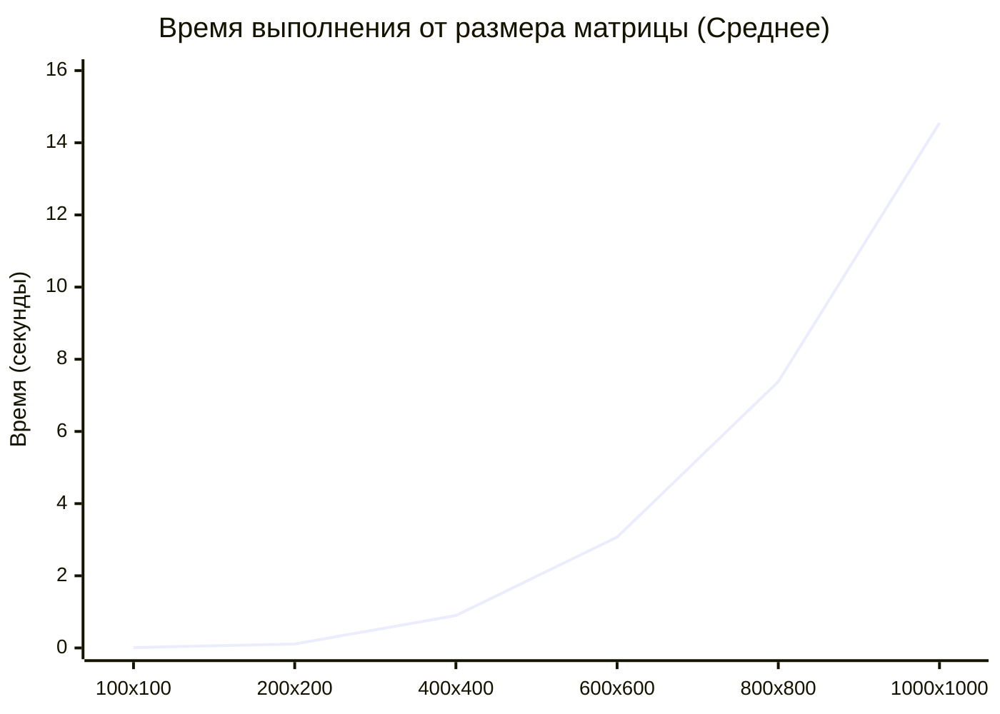
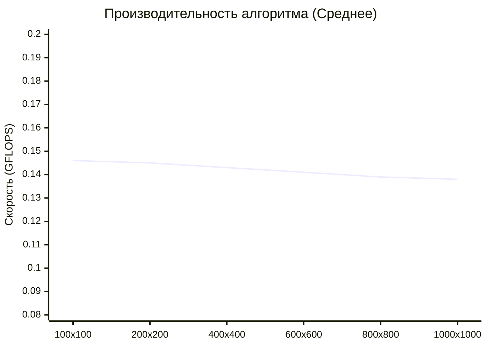

# Перемножение квадратных матриц на C++ с верификацией на Python (Последовательная программа)

Программа на языке C++ для генерации и перемножения квадратных матриц произвольного размера. Проект включает автоматическую верификацию результатов вычислений с помощью сторонней библиотеки **NumPy** на Python.

## Особенности реализации
- **C++ Modules**: Использование стандарта C++23 и модулей (`import std;`, `import GenerateMatrix;`).
- **Эффективный алгоритм**: Обход циклов организован в оптимальном для процессора порядке `i-k-j`.
- **Выходные данные**: объем выделенной памяти, время вычислений и производительность в **GFLOPS**.

## Структура проекта
- `GenerateMatrix.ixx` — C++ модуль автоматической генерации тестовых матриц со случайными вещественными числами.
- `main.cpp` — основной код программы (чтение, умножение, расчет GFLOPS, запись).
- `verif.py` — Python-скрипт для проверки вычислений.
- `requirements.txt` — список зависимостей для Python-окружения.

## Алгоритм
```cpp
auto start_time = std::chrono::steady_clock::now();
for (int i = 0; i < n; ++i) {
	for (int k = 0; k < n; ++k) {
		double a = A[i][k];
		for (int j = 0; j < n; ++j) {
			C[i][j] += a * B[k][j];
		}
	}
}
auto end_time = std::chrono::steady_clock::now();
```
- **Линейная сложность** N(3).
- Порядок циклов `i-k-j` - элементы матриц читаются из памяти строка за строкой, непрерывно. Это позволяет данным ложиться в сверхбыстрый кэш процессора, исключая простои в ожидании медленной оперативной памяти.

## Результаты

- Производительность измерена в GFLOPS (сколько миллиардов математических операций с плавающей запятой процессор выполняет за одну секунду).

| Размерность (N x N) | Память (МБ) | Число операций (FLOP) | Время выполнения (сек) | Производительность (GFLOPS) |
| :--- | :---: | :---: | :---: | :---: |
| **1000 x 1000** | 22.89 | 2 000 000 000 | 14.960591 | 0.1337 |
| | 22.89 | 2 000 000 000 | 14.311485 | 0.1397 |
| | 22.89 | 2 000 000 000 | 14.391532 | 0.1390 |
| **800 x 800** | 14.65 | 1 024 000 000 | 7.432406 | 0.1378 |
| | 14.65 | 1 024 000 000 | 7.370572 | 0.1389 |
| | 14.65 | 1 024 000 000 | 7.345805 | 0.1394 |
| **600 x 600** | 8.24 | 432 000 000 | 3.033383 | 0.1424 |
| | 8.24 | 432 000 000 | 3.177211 | 0.1360 |
| | 8.24 | 432 000 000 | 3.003726 | 0.1438 |
| **400 x 400** | 3.66 | 128 000 000 | 0.947052 | 0.1352 |
| | 3.66 | 128 000 000 | 0.907888 | 0.1410 |
| | 3.66 | 128 000 000 | 0.838615 | 0.1526 |
| **200 x 200** | 0.92 | 16 000 000 | 0.104461 | 0.1532 |
| | 0.92 | 16 000 000 | 0.126754 | 0.1262 |
| | 0.92 | 16 000 000 | 0.102729 | 0.1557 |
| **100 x 100** | 0.23 | 2 000 000 | 0.013591 | 0.1472 |
| | 0.23 | 2 000 000 | 0.015223 | 0.1314 |
| | 0.23 | 2 000 000 | 0.012514 | 0.1598 |

- Средние результаты.

| Размерность (N x N) | Память (МБ) | Операций (FLOP) | Среднее время (сек) | Средняя скорость (GFLOPS) |
| :--- | :---: | :---: | :---: | :---: |
| **1000 x 1000** | 22.89 | 2 000 000 000 | 14.5545 | 0.1375 |
| **800 x 800** | 14.65 | 1 024 000 000 | 7.3829 | 0.1387 |
| **600 x 600** | 8.24 | 432 000 000 | 3.0714 | 0.1407 |
| **400 x 400** | 3.66 | 128 000 000 | 0.8979 | 0.1429 |
| **200 x 200** | 0.92 | 16 000 000 | 0.1113 | 0.1450 |
| **100 x 100** | 0.23 | 2 000 000 | 0.0138 | 0.1461 |





## Выводы

- Производительность во всем диапазоне размеров матриц (от 100 до 1000) держится на стабильном уровне 0.137 – 0.146 GFLOPS. Это подтверждает, что оптимизация циклов i-k-j работает: скорость не падает резко при увеличении объемов данных, кэш-память используется эффективно.
- Кубический рост времени.
  
## Инструкция по сборке и запуску

### 1. Компиляция и запуск C++
Для сборки требуется современный компилятор с поддержкой C++23 (MSVC, GCC или Clang).

**Через Visual Studio (Developer Command Prompt):**
```bash
cl /std:c++latest /EHsc /O2 GenerateMatrix.cpp main.cpp /Fe:matrix_app.exe
matrix_app.exe
```

**Через GCC (g++ в Linux):**
```bash
g++ -std=c++23 -fmodules-ts -O3 -c GenerateMatrix.cpp
g++ -std=c++23 -fmodules-ts -O3 GenerateMatrix.o main.cpp -o matrix_app
./matrix_app
```

### 2. Верификация (проверка) результатов на Python
После работы C++ программы в папке появятся файлы `matrixA.txt`, `matrixB.txt` и `resultC.txt`. Для проверки точности вычислений выполните:

```bash
# Установка необходимых библиотек (NumPy)
pip install -r requirements.txt

# Запуск автоматического тестирования
python verif.py
```
При успешном прохождении теста скрипт выведет:  
`Матрицы совпадают.`
