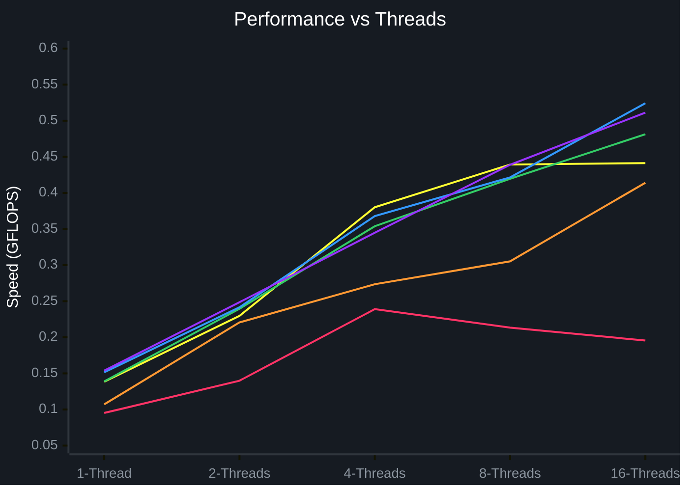

# Распараллеливание программы с помощью OpenMP 

## Алгоритм

```cpp
#pragma omp parallel for
	for (int i = 0; i < n; ++i) {
		for (int k = 0; k < n; ++k) {
			double a = A[i][k];
			for (int j = 0; j < n; ++j) {
				C[i][j] += a * B[k][j];
			}
		}
	}
```

Так как переменные `k`, `j` и `a` объявляются внутри параллельного цикла `i`, OpenMP автоматически делает их `private` (индивидуальными для каждого потока). Потоки не будут путаться в индексах друг друга и не возникнет состояния гонки (`race condition`). Матрицы A, B и C остаются общими (`shared`), что правильно: мы из них только читаем, а в матрицу C каждый поток пишет строго в свои строки `i`, закрепленные за ним, поэтому они не мешают друг другу.

## Результаты

| Размерность (N x N) | Память (МБ) | Операций (FLOP) | Потоки | Время (сек) | Скорость (GFLOPS) |
| :--- | :---: | :---: | :---: | :---: | :---: |
| **100 x 100** | 0.23 | 2 000 000 | 1 | 0.021011 | 0.0952 |
| | | | 2 | 0.014301 | 0.1399 |
| | | | 4 | 0.008370 | 0.2390 |
| | | | 8 | 0.009374 | 0.2134 |
| | | | 16 | 0.010228 | 0.1955 |
| **200 x 200** | 0.92 | 16 000 000 | 1 | 0.149390 | 0.1071 |
| | | | 2 | 0.072523 | 0.2206 |
| | | | 4 | 0.058492 | 0.2735 |
| | | | 8 | 0.052419 | 0.3052 |
| | | | 16 | 0.038634 | 0.4141 |
| **400 x 400** | 3.66 | 128 000 000 | 1 | 0.924901 | 0.1384 |
| | | | 2 | 0.557314 | 0.2297 |
| | | | 4 | 0.336646 | 0.3802 |
| | | | 8 | 0.291403 | 0.4393 |
| | | | 16 | 0.290036 | 0.4413 |
| **800 x 800** | 14.65 | 1 024 000 000 | 1 | 7.372870 | 0.1389 |
| | | | 2 | 4.275695 | 0.2395 |
| | | | 4 | 2.893402 | 0.3539 |
| | | | 8 | 2.440881 | 0.4195 |
| | | | 16 | 2.127653 | 0.4813 |
| **1200 x 1200** | 32.96 | 3 456 000 000 | 1 | 22.807908 | 0.1515 |
| | | | 2 | 14.305785 | 0.2416 |
| | | | 4 | 9.394314 | 0.3679 |
| | | | 8 | 8.198985 | 0.4215 |
| | | | 16 | 6.593466 | 0.5242 |
| **1600 x 1600** | 58.59 | 8 192 000 000 | 1 | 53.276265 | 0.1538 |
| | | | 2 | 32.956125 | 0.2486 |
| | | | 4 | 23.758133 | 0.3448 |
| | | | 8 | 18.659623 | 0.4390 |
| | | | 16 | 16.024331 | 0.5112 |

### Зависимость скорости (GFLOPS) от числа потоков


* **Красная линия:** Матрица `100 x 100` *(на 16 потоках падает вниз)*
* **Оранжевая линия:** Матрица `200 x 200`
* **Желтая линия:** Матрица `400 x 400`
* **Зеленая линия:** Матрица `800 x 800`
* **Голубая линия:** Матрица `1200 x 1200` *(самая верхняя точка в конце)*
* **Фиолетовая линия:** Матрица `1600 x 1600`

## Выводы

1. **Эффективность распараллеливания:** OpenMP ускорила вычисления. Наибольший выигрыш по времени заметен на максимальной матрице **1600x1600** — время расчетов сократилось с **53.27 до 16.02 секунд** (ускорение в **3.33 раза**).
2. **Пиковая производительность:** Максимум производительности достигнут на матрице **1200x1200** при 16 потоках: **0.5242 GFLOPS**, почти в **4 раза** превосходит однопоточный вариант.
3. **Накладные расходы:** На малых объемах данных (`100x100`) избыточное распараллеливание вредит скорости. Пик производительности достигается на 4 потоках (**0.2390 GFLOPS**), а при 8 и 16 потоках скорость падает. Это связано с тем, что время на создание потоков начинает превышать время вычисления самой матрицы.
4. **После 4–8 потоков рост GFLOPS на больших матрицах замедляется:** возможно, память компьютера не успевает за процессором.


